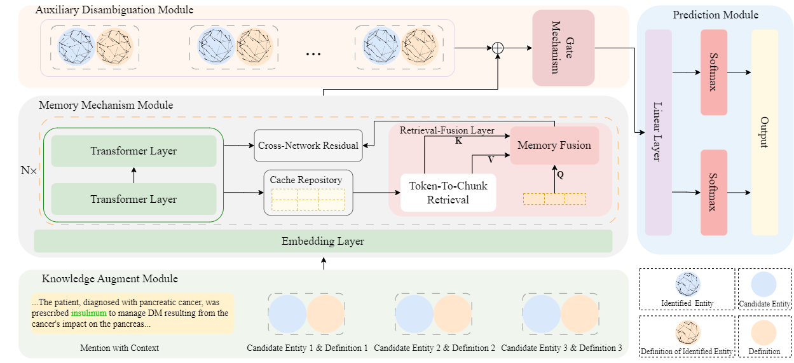

 <h1 align ="center"> Extractive Medical Entity Disambiguation with Memory Mechanism and Memorized entity Entity Information </h1>
Code for the paper "Extractive Medical Entity Disambiguation with Memory Mechanism and Identified Entity Information". 
In this paper, we propose a novel approach called Extractive Medical Entity Disambiguation with Memory Mechanism and Identified Entity Information. Specifically, we reframe MED as a text extraction task, which simultaneously accepts the entire context of medical mentions, all possible candidate entities, and entity definitions, and it is then trained to extract the text span corresponding to the correct entity.. 



## Setup

Requirements:
* Debian-based (e.g. Debian, Ubuntu, ...) system 
* [conda](https://docs.conda.io/en/latest/) installed

Run the following command to quickly setup the env needed to run our code:
```bash
bash setup.sh
```

## Data Preparation
We conduct experiments on two real-world public biomedical datasets for MED, which are MedMentions and BC5CDR. You can download the MedMentions dataset [[here](https://github.com/chanzuckerberg/MedMentions)]and BC5CDR dataset [[here](http://www.biocreative.org/tasks/biocreative-v/track-3-cdr/)], then unpack it in the data folder.
The original datasets can be downloaded from the following URLs.


## Download BioBART model
Download the [BioBART-v2](https://github.com/GanjinZero/BioBART) model and place is under the root directory ./biobart.

## Train the MMIE Model on the Dataset
If you want to train own model you just have to run the following command in the MMIE folder:
```bash
python mmie/train.py
```
If you want to evaluate the model on a dataset, just add the parameter ```--evaluate``` on the previous command.

```
